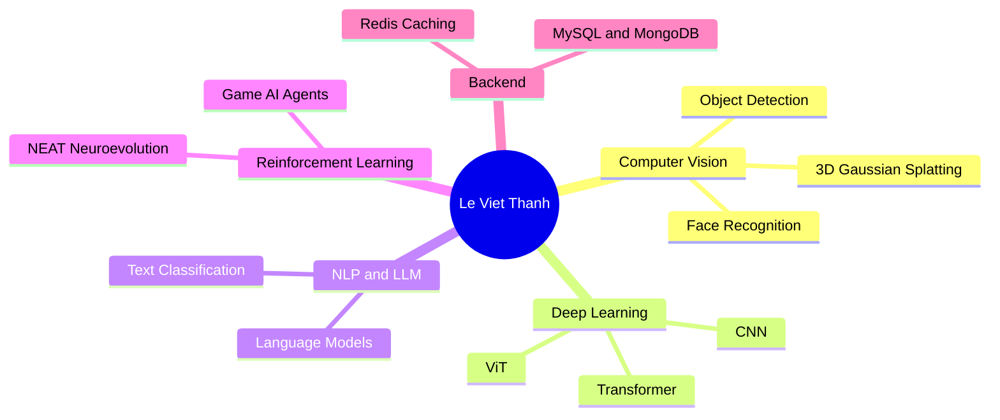

<div align="center">

<!-- Animated Header Banner -->


<!-- Typing animation -->
<a href="https://git.io/typing-svg">
  
</a>

<br/>

<!-- Social Badges -->
[](https://www.linkedin.com/in/levietThanh1412/)
[](https://github.com/LeVietThanh1412)
[](mailto:levietThanh1412@gmail.com)


</div>

---

## 🧬 About Me

<table>
  <tr>
    <td width="60%" valign="top">

```python
class LeVietThanh:
    def __init__(self):
        self.name        = "Le Viet Thanh"
        self.university  = "UET – VNU Hanoi"
        self.major       = "Artificial Intelligence"
        self.gpa         = 3.41 / 4.0
        self.dsa_score   = 9.8 / 10
        self.nat_score   = 9.0 / 10  # National HS exam

        self.interests = [
            "Deep Learning for Computer Vision",
            "3D Neural Rendering (3DGS, NeRF)",
            "Large Language Models (LLM)",
            "Reinforcement Learning",
            "Neuroevolution (NEAT)",
        ]

        self.currently_learning = [
            "3D Gaussian Splatting",
            "Advanced Redis patterns",
            "Transformer architectures",
        ]

    def motto(self):
        return "Never Too Late to Pursue Your Dreams"
```

  </td>
  <td width="40%" align="center" valign="top">
    
    <br/><br/>
    
  </td>
  </tr>
</table>

---

## 🛠️ Tech Stack & Skills

<div align="center">

### 🧠 AI / Machine Learning


### 🧱 Deep Learning Architectures


### 💾 Databases & Caching


### 💻 Languages & Tools


</div>

---

## 🌟 Featured Projects

<div align="center">

<!-- VDT 3DGS -->
<a href="https://github.com/LeVietThanh1412/vdt-2026-3d-gaussian-splatting">
  
</a>
<!-- Smart Attendance -->
<a href="https://github.com/LeVietThanh1412/BTL-2526II_AIT3004_2-smart_attendance_system">
  
</a>

</div>

<div align="center">

<!-- Flappy Bird NEAT -->
<a href="https://github.com/LeVietThanh1412/flappy-bird-neat">
  
</a>
<!-- LTXLDL -->
<a href="https://github.com/LeVietThanh1412/2526-LTXLDL-Project-AIT2006-2-4.2">
  
</a>

</div>


---

## 📊 GitHub Stats

<div align="center">


<br/>


</div>

---

## 🏅 Achievements & Scores

<div align="center">

| 🎯 Metric | 📈 Score |
|---|---|
| 🎓 GPA | **3.41 / 4.0** |
| 💻 Data Structures & Algorithms | **9.8 / 10** |
| 📝 National High School Exam | **9.0 / 10** |
| 🤖 Deep Learning & Machine Learning | Completed |

</div>

---

## 🎯 Skills Map



---

<div align="center">

## 🤝 Let's Connect & Collaborate!

> *"The best way to predict the future is to invent it."* — Alan Kay

I'm always open to **collaborating on AI/ML projects**, discussing research ideas, or just having a chat about the latest in deep learning!

<br/>

[](https://github.com/LeVietThanh1412)
[](mailto:thanhdevuetvnu2024@gmail.com)

<br/>


</div>
